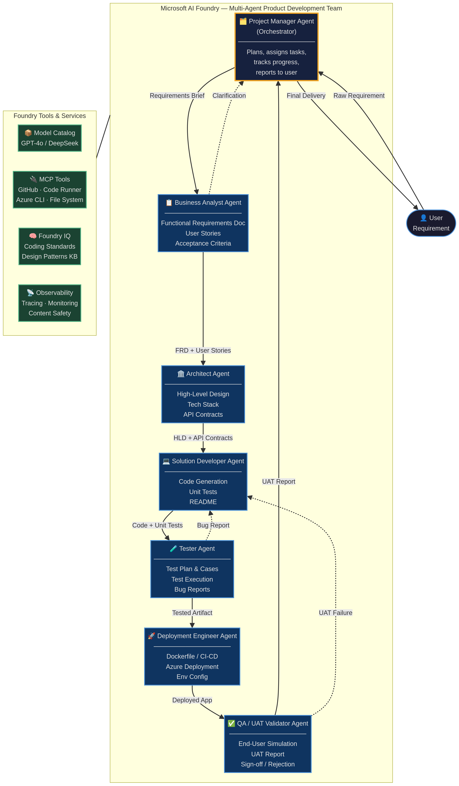

# Microsoft AI Foundry: Hands-On Project Builder

**Author:** Manus AI  
**Last Updated:** March 2026  

## Overview

This repository is a 100% hands-on, project-driven guide to mastering **Microsoft AI Foundry**. Instead of isolated labs, we are building a complete, production-ready AI application from scratch. As we build each feature, we naturally learn the corresponding Microsoft AI Foundry capabilities—from deploying models and building agents to implementing multi-agent orchestration and observability.

## The Project: "AI DevTeam" (Multi-Agent Product Development)

We are building a **virtual product development team** where each role is a specialized AI agent. You provide a raw user requirement (e.g., "Build a weather dashboard app"), and the agents coordinate to gather requirements, design the architecture, write the code, test it, deploy it, and validate it.

This use case perfectly exercises Microsoft AI Foundry's advanced capabilities, specifically the **Foundry Agent Service** and **Multi-Agent Orchestration**.

### The Virtual Team

| Agent Role | Responsibility | Artifacts Produced |
| :--- | :--- | :--- |
| **Project Manager (PM)** | The Orchestrator. Receives the user requirement, plans the workflow, assigns tasks to other agents, and tracks progress. | Project Charter, Status Updates |
| **Business Analyst (BA)** | Clarifies the raw requirement and translates it into actionable development tasks. | Functional Requirements (FRD), User Stories |
| **Architect** | Takes the requirements and designs the technical solution, selecting the stack and defining APIs. | High-Level Design (HLD), API Contracts |
| **Solution Developer** | Writes the actual code based on the Architect's design and BA's user stories. | Source Code, Unit Tests, README |
| **Tester** | Executes the code and runs tests against the Acceptance Criteria to ensure quality. | Test Plan, Bug Reports |
| **Deployment Engineer** | Packages the tested code for deployment and writes infrastructure scripts. | Dockerfile, CI/CD YAML |
| **QA / UAT Validator** | Performs final User Acceptance Testing from an end-user perspective before final sign-off. | UAT Report, Sign-off |

### Architecture Diagram

*(See `design_notes.md` for a detailed breakdown of agent interactions and tool usage).*

---

## The Learning Strategy: "Learn as You Build"

Our learning journey is structured around the software development lifecycle of the AI DevTeam project.

| Phase | Development Stage | AI Foundry Skills Acquired |
| :--- | :--- | :--- |
| **Phase 1** | Project Initialization & Infrastructure | Navigating the Foundry Portal, setting up projects, Role-Based Access Control (RBAC). |
| **Phase 2** | Core Intelligence (The "Brain") | Deploying models from the Model Catalog (OpenAI, DeepSeek, etc.), using the Foundry SDK (Python/C#). |
| **Phase 3** | Single Agent Setup & Tools | Creating the first agent (e.g., Developer) and equipping it with MCP tools (File System, Code Runner). |
| **Phase 4** | Multi-Agent Orchestration | Implementing the PM Orchestrator and defining the handoff logic between the BA, Architect, and Developer. |
| **Phase 5** | Production Readiness (The "Guardrails") | Implementing tracing (OpenTelemetry), Agent Monitoring Dashboard, and Azure AI Content Safety. |

---

## Phase 1: Foundation & Setup

Before writing code, we need a solid foundation. In this phase, we will set up our cloud environment and establish our local development workspace.

1.  **Environment Setup:** Create an Azure account and deploy a new Microsoft AI Foundry project workspace.
2.  **Local Workspace:** Initialize a local Git repository, set up a Python virtual environment, and install the `azure-ai-projects` and `azure-ai-inference` SDKs.
3.  **Authentication:** Configure Azure CLI and set up secure, keyless authentication (`DefaultAzureCredential`) for local development.

---

## Phase 2: Core Intelligence (Model Deployment)

An AI application needs a brain. We will explore the Model Catalog and write our first lines of code to interact with a Large Language Model (LLM).

1.  **Model Selection:** Browse the Foundry Model Catalog and deploy a foundation model (e.g., GPT-4o) as a serverless API endpoint.
2.  **Basic Inference:** Write a simple script using the Foundry SDK to send a prompt to the deployed model and receive a response.
3.  **System Prompts:** Learn how to craft system prompts to define the persona and tone of our first agent.

---

## Phase 3: Single Agent Setup & Tools

An AI that only chats is limited. We will upgrade our application into an "Agent" that can take actions, starting with the **Solution Developer Agent**.

1.  **Defining Tools:** Create Python functions that perform specific tasks (e.g., writing files to disk, running a Python script in a sandbox).
2.  **Agent Orchestration:** Use the Foundry Agent Service to bind our deployed model with the tools we created.
3.  **Model Context Protocol (MCP):** Implement an MCP server to standardize how our Developer agent interacts with the local file system and GitHub.

---

## Phase 4: Multi-Agent Orchestration

This is the core of the project. We will build the rest of the team and establish the communication pipeline.

1.  **Agent Creation:** Instantiate the PM, BA, Architect, Tester, Deployment Engineer, and QA agents using the Foundry SDK.
2.  **The Orchestrator Pattern:** Program the PM Agent to act as the router, taking the output from one agent (e.g., BA's User Stories) and passing it as input to the next (e.g., Architect).
3.  **Feedback Loops:** Implement logic so the Tester Agent can send bug reports back to the Developer Agent for fixing before passing the code to Deployment.

---

## Phase 5: Observability & Content Safety

Before calling a project "done," we must ensure it is safe, reliable, and easy to debug.

1.  **Tracing:** Integrate OpenTelemetry into our code to log every LLM call, tool execution, and agent handoff to the Foundry portal.
2.  **Monitoring Dashboard:** Navigate the Agent Monitoring Dashboard in Foundry to visualize token usage and execution traces across our 7-agent team.
3.  **Content Safety:** Implement Azure AI Content Safety guardrails to automatically detect and block malicious prompts or generated code that contains security vulnerabilities.

---

## Next Steps

We are ready to begin **Phase 1**. When you are ready, let's start setting up the Azure AI Foundry workspace and local Python environments.
